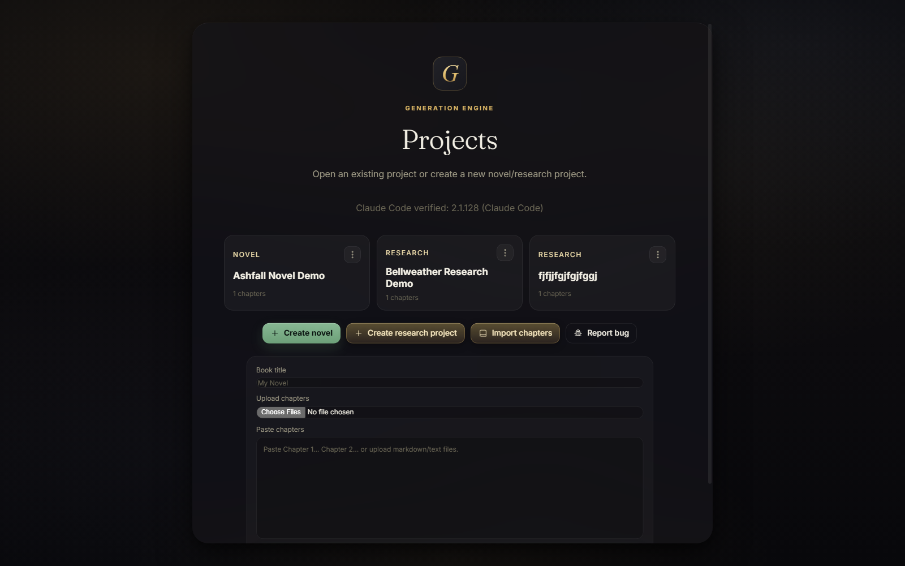
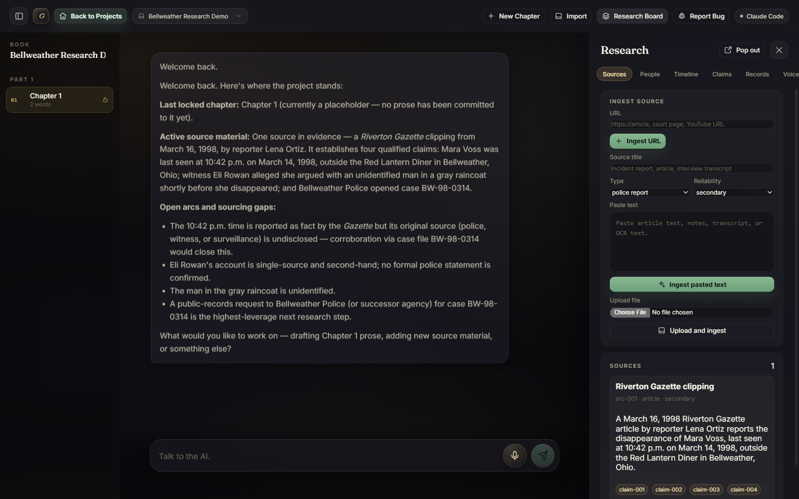
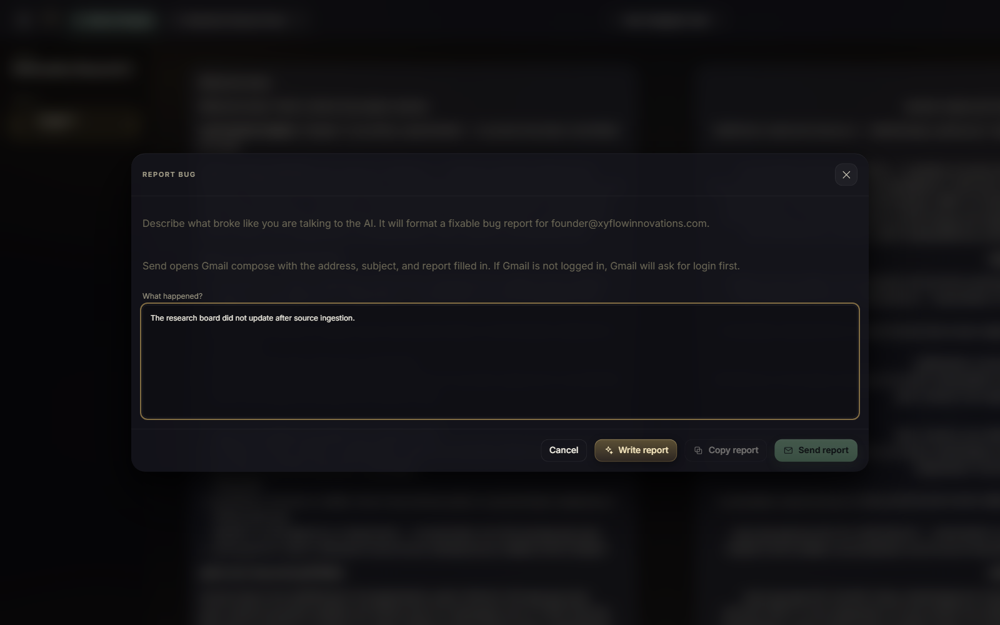

# Generation Engine

Generation Engine is a local-first native desktop app for long-form writing projects. It gives one author a chat-first collaboration surface backed by plain files on disk.

The app supports two project types:

- **Novel**: voice-first chapter drafting with editable canon for world, characters, timeline, arcs, sections, and prose voice.
- **Research**: nonfiction/true-crime research with sources, people/entities, timeline, atomic claims, records requests, citation-aware drafting, and pre-export sourcing checks.

The current build is designed for a single Windows user or small private beta. It runs locally, stores projects under `books/`, and can use Claude Code CLI or Anthropic API for generation.

## Why It Exists

Most AI writing tools hide memory in a black box. Generation Engine keeps project memory visible and editable:

- chapters are markdown files
- canon/research memory is markdown and JSON
- source files are preserved under each project
- conversations persist per project
- drafts are saved only when the user explicitly chooses to save them

For research projects, the app is source-led. It extracts claims from evidence, drafts with claim markers, and flags unsupported assertions instead of inventing facts.

## Features

- Native Electron desktop shell with local Python backend
- Chat-first UI with persistent project conversation
- Claude Code CLI mode, Anthropic API mode, and fiction-only fallback mode
- Local voice transcription path
- Research source ingestion from pasted text, URLs, uploads, PDFs, OCR, and audio where local tools are available
- Claims matrix with source references and publish-readiness flags
- Storyboard/research board side drawer
- Floating chapter windows for reading and manual editing
- Explicit project lock/delete controls
- AI-written bug reports that open Gmail compose addressed to the maintainer
- GitHub Releases update checker for beta installs

## Screenshots







## Configuration

Copy `config.example.json` to `config.local.json`.

Claude Code CLI mode:

```json
{
  "mode": "claude-code"
}
```

Anthropic API mode:

```json
{
  "mode": "api",
  "anthropicApiKey": "your-key"
}
```

Release updates:

```json
{
  "update": {
    "repo": "Xyloth/Generation-Engine"
  }
}
```

`config.local.json` is ignored by Git and should never be committed.

## Start

```powershell
start.bat
```

This opens the native desktop shell and starts the local backend.

## Portable Install

For a Windows beta machine:

1. Copy the release folder to the target machine.
2. Put any private `config.local.json` in the folder.
3. Double-click `install.bat`.
4. Launch **Generation Engine** from the desktop shortcut.

The app creates required local folders automatically.

## Release Packaging

Build a portable release zip:

```powershell
powershell -NoProfile -ExecutionPolicy Bypass -File scripts\package-release.ps1 -Root .
```

Upload `dist/Generation_Engine-v<version>.zip` to a GitHub Release whose tag is `v<version>`.

If the GitHub repo already exists and `gh auth login` has been completed, publish the current committed version with:

```powershell
powershell -NoProfile -ExecutionPolicy Bypass -File scripts\publish-release.ps1 -Repo Xyloth/Generation-Engine
```

The in-app **Check for update** button reads the latest GitHub Release, downloads the zip, preserves `books/` and `config.local.json`, replaces app files, refreshes the desktop shortcut, and restarts.

## Repository Safety

The public repo intentionally excludes:

- `books/`
- `config.local.json`
- `ANTHROPIC_API_KEY.txt`
- `runtime/`
- `desktop/node_modules/`
- generated logs, temp files, and release zips

Release zips include the portable runtime and Electron dependencies. Source control does not.
